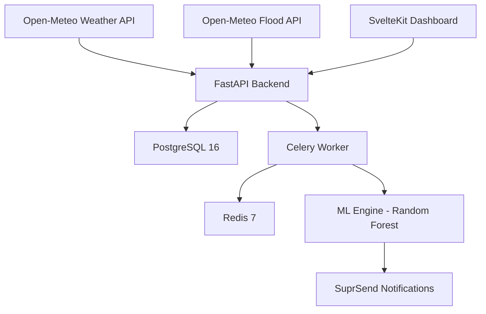

# Otuoke FloodWatch 🌊 v2.0

Production-ready flood early-warning platform for Federal University Otuoke. This system monitors real-time environmental conditions using Open-Meteo APIs, predicts flood risk using machine learning, and dispatches multi-channel alerts to registered users.

---

## 🚀 Key Features

- **Real-time Data**: Live weather data from Open-Meteo API (no API key required).
- **River Monitoring**: River discharge data from Open-Meteo Flood API.
- **Machine Learning**: Random Forest model trained on historical Otuoke weather data.
- **Background Automation**: Automated data fetching and prediction via Celery & Redis.
- **Multi-channel Alerts**: Notifications via **SuprSend** (SMS, Email, Push) with deduplication.
- **Mobile-First UI**: Responsive SvelteKit dashboard with bottom navigation.

---

## 🏗️ Architecture



---

## 🛠️ Setup Guide

### 1. Prerequisites
- **Python 3.12+**, **Node.js 20+**, **Docker**

### 2. Infrastructure
```bash
docker compose up -d
```

### 3. Backend (FastAPI)
```bash
cd backend
python3 -m venv venv
source venv/bin/activate
pip install -r requirements.txt

# Train the ML model (fetches real historical data)
python -m app.ml.train

# Start the API
uvicorn app.main:app --reload

# Start workers (separate terminals)
celery -A app.tasks.celery_app worker --loglevel=info
celery -A app.tasks.celery_app beat --loglevel=info
```

### 4. Frontend (SvelteKit)
```bash
cd frontend
npm install
npm run dev
```

---

## 🌍 Data Sources

| Data | Source | Cost |
|---|---|---|
| Weather (rain, temp, humidity, wind, pressure) | Open-Meteo Weather API | Free |
| River Discharge | Open-Meteo Flood API | Free |
| Historical Training Data | Open-Meteo Archive API | Free |

---

## 📊 API Endpoints

| Method | Endpoint | Description |
|---|---|---|
| GET | `/api/health` | System health check |
| GET | `/api/weather/latest` | Latest weather reading |
| GET | `/api/predictions/latest` | Latest flood risk prediction |
| GET | `/api/alerts` | Alert history |
| POST | `/api/users` | Register for alerts |
