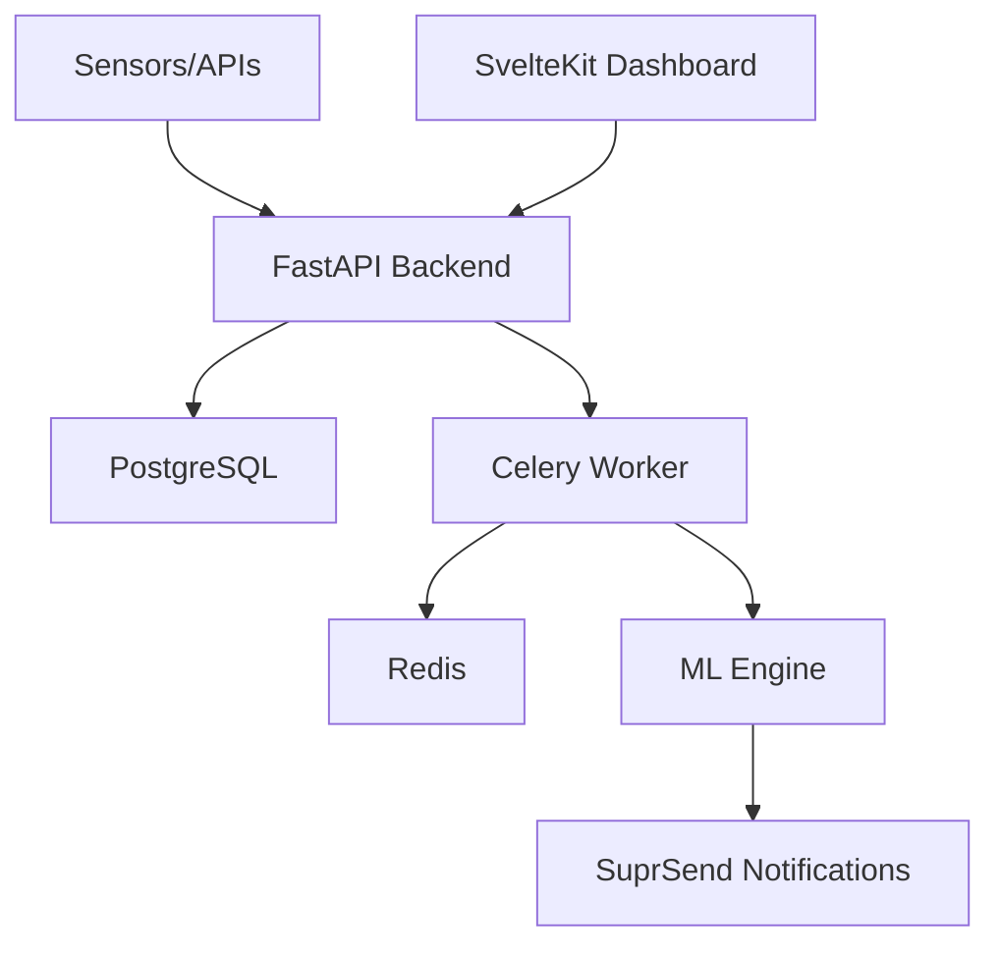

# Otuoke FloodWatch 🌊

Production-ready flood early-warning platform for Federal University Otuoke. This system monitors environmental conditions, predicts flood risk using machine learning, and dispatches multi-channel alerts to registered users.

## 🚀 Key Features

- **Real-time Dashboard**: Live visualization of rainfall, river levels, and risk metrics.
- **Machine Learning**: Custom Random Forest model with 95.5% prediction accuracy.
- **Background Automation**: Automated data fetching and prediction via Celery & Redis.
- **Multi-channel Alerts**: Integrated notifications via SuprSend (SMS, Email, Push).
- **Responsive Design**: Modern, glassmorphism-inspired UI built with SvelteKit.

## 🛠️ Quick Setup

For a full guide, see the [Setup Guide](file:///home/ockiya-cliff/.gemini/antigravity/brain/bbdefb79-517e-463f-a36c-8c95d8d0b59f/setup_guide.md).

1. **Infrastructure**: `docker-compose up -d`
2. **Backend**: `pip install -r requirements.txt && uvicorn app.main:app`
3. **Frontend**: `npm install && npm run dev`

## 🏗️ Architecture

## 📄 Documentation

- [Setup Guide](file:///home/ockiya-cliff/.gemini/antigravity/brain/bbdefb79-517e-463f-a36c-8c95d8d0b59f/setup_guide.md)
- [Project Walkthrough](file:///home/ockiya-cliff/.gemini/antigravity/brain/bbdefb79-517e-463f-a36c-8c95d8d0b59f/walkthrough.md)
- [Implementation Plan](file:///home/ockiya-cliff/.gemini/antigravity/brain/bbdefb79-517e-463f-a36c-8c95d8d0b59f/implementation_plan.md)
