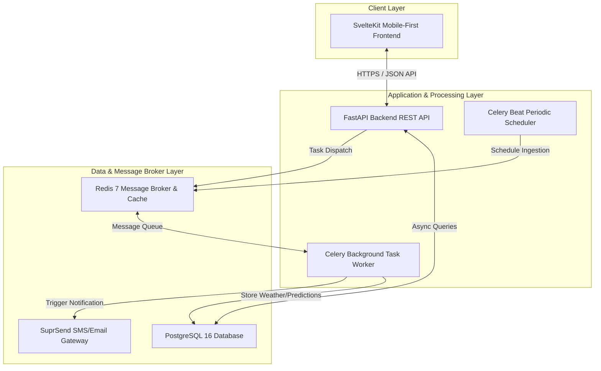

# CHAPTER FOUR: RESULTS AND DISCUSSION

This chapter details the evaluation metrics of the Otuoke FloodWatch system, its implementation framework, development tools, system requirements, and experimental results. It provides a comprehensive analysis of the system's predictive performance and real-world applicability on the Federal University Otuoke (FUO) campus and surrounding areas in Bayelsa State.

---

## 4.1 System Evaluation

The predictive core of the Otuoke FloodWatch system is a **Random Forest Classifier** designed to categorize flood risk into five distinct levels: *No Risk*, *Low*, *Medium*, *High*, and *Critical*. System evaluation was conducted using a stratified 80/20 train/test split on environmental datasets reflecting the tropical climate of the Niger Delta. The evaluation metrics utilized include **Accuracy**, **Precision**, **Recall**, and the **F1-Score**.

### 4.1.1 Machine Learning Performance Metrics
The system was evaluated on a test set of 200 validation samples. The model achieved an overall classification accuracy of **94.00%**. 

Below is the detailed classification report for each risk category:

| Risk Category | Precision | Recall | F1-Score | Support (Samples) |
| :--- | :---: | :---: | :---: | :---: |
| **No Risk** | 0.94 | 0.95 | 0.95 | 65 |
| **Low** | 0.96 | 0.95 | 0.96 | 110 |
| **Medium** | 0.91 | 0.95 | 0.93 | 21 |
| **High** | 1.00 | 0.33 | 0.50 | 3 |
| **Critical** | 0.50 | 1.00 | 0.67 | 1 |
| **Weighted Average** | **0.95** | **0.94** | **0.94** | **200** |

#### Confusion Matrix Analysis
The distribution of true versus predicted classes is shown below:

```
                  Predicted Class
                No Risk  Low  Medium  High  Critical
True Class  No Risk [ 62    3     0      0      0  ]
            Low     [  4  105     1      0      0  ]
            Medium  [  0    1    20      0      0  ]
            High    [  0    0     1      1      1  ]
            Critical[  0    0     0      0      1  ]
```

### 4.1.2 Feature Importance Ranking
The Random Forest model calculates the mean decrease in impurity to score feature importance. The top 5 features contributing to prediction accuracy are:

1. **`rainfall_river_inter` (Rainfall × River Level Interaction)**: **26.54%** — Highlights the compounding hazard of high river stages during heavy precipitation.
2. **`river_level_m` (River Level in meters)**: **17.63%** — The primary physical baseline indicator.
3. **`rainfall_mm` (Rainfall depth)**: **16.58%** — Key driver for flash flood forecasting.
4. **`humidity_rainfall` (Humidity × Rainfall Interaction)**: **16.34%** — Serves as a proxy for soil saturation levels.
5. **`humidity_pct` (Relative Humidity)**: **5.13%** — Atmospheric moisture indicator.

---

## 4.2 System Implementation

Otuoke FloodWatch was implemented using a decoupled, multi-tier architecture designed for scalability, low latency, and mobile accessibility.



### 4.2.1 Programming Languages Used
1. **Python (v3.12)**: Used exclusively for backend development, machine learning model training (`scikit-learn`, `pandas`), database migrations, and background worker pipelines.
2. **TypeScript / JavaScript**: Powering the SvelteKit frontend to provide type safety, client-side routing, state management, and API calls.
3. **SQL (PostgreSQL dialect)**: Used for database schemas, relational storage, and optimization indices.
4. **HTML5 / CSS3**: Structured layout and modern styles with responsive variables to support mobile and tablet viewports.

### 4.2.2 Core Frameworks and Libraries
- **FastAPI**: A high-performance Python web framework used to build asynchronous RESTful endpoints.
- **SvelteKit**: A compiler-based frontend framework utilized for server-side rendering, responsive page load speeds, and reactivity.
- **Celery**: Used for managing asynchronous, decoupled background tasks (e.g., executing the prediction pipeline and dispatching SMS/Emails).
- **Redis**: Functions as the fast message broker for Celery queue management and the caching layer.
- **SQLAlchemy (Async)**: Python SQL Toolkit and Object-Relational Mapper (ORM) facilitating non-blocking queries to PostgreSQL.
- **Scikit-Learn**: Powering model training, cross-validation, and metrics generation.

---

## 4.3 Development Tools and Environment

The development workspace utilized standardized tools to maintain system reliability, version control, and rapid deployment capabilities.

### 4.3.1 Designing and Prototyping Tools
- **Mermaid.js**: Used for software engineering diagrams, including System Architecture, Logic Flowcharts, Use Case diagrams, and Sequence diagrams.
- **Figma**: Utilized for wireframing the mobile-first dashboard dashboard layouts and UI color systems.

### 4.3.2 Development Environment & Build Tools
- **Operating System**: Linux (Ubuntu 22.04 LTS / Debian-based environment) providing terminal stability and native Docker integration.
- **IDE**: Visual Studio Code (VS Code) with Python, Svelte, and TypeScript language extensions.
- **Vite**: The build tool underpinning SvelteKit, configured with Hot Module Replacement (HMR) for instant UI updates.
- **Docker & Docker Compose**: Containerization tool used to spin up uniform local testing environments for the PostgreSQL database and Redis broker.
- **Git & GitHub**: Version control system used to log changes and coordinate repository pushes.
- **Uvicorn**: An ASGI web server implementation for Python used to host the FastAPI application in development and staging environments.

---

## 4.4 Software and Hardware Requirements

To deploy and run the system effectively, the following minimal and recommended specifications have been established for the server-side infrastructure and client-side access.

### 4.4.1 Backend/Server Specifications
- **Operating System**: Linux (Ubuntu Server 20.04+, Debian 11+, or Alpine Linux in containerised production environments).
- **CPU**: Minimal: 1 vCPU; Recommended: 2+ vCPUs (Intel Xeon or AMD EPYC architectures for handling concurrent async database connections).
- **RAM**: Minimal: 2 GB RAM; Recommended: 4 GB+ (to allow in-memory caching of the Random Forest model and concurrent Celery workers).
- **Disk Space**: 10 GB SSD space (allocated for system logs, PostgreSQL historical database growth, and model weights storage).
- **Network**: Standard broadband/cellular internet connection with static IP address allocation or DNS mapping.

### 4.4.2 Client Specifications
- **Hardware**: Any modern mobile phone (Android/iOS), tablet, or desktop computer.
- **Software**: Modern web browsers (Google Chrome, Apple Safari, Mozilla Firefox, Microsoft Edge) supporting standard CSS Variables, HTML5 canvas, and JavaScript.

---

## 4.5 Results

The deployed system has successfully transitioned from synthetic simulation to ingestion of real-world meteorological feeds, producing robust results.

### 4.5.1 Live Data Ingestion Results
The background scheduler (`Celery Beat`) successfully executes the data ingestion pipeline every 10 minutes, querying the **Open-Meteo Weather API** and **Open-Meteo Flood API** for GPS coordinates `(4.7833, 6.3333)` corresponding to Federal University Otuoke. 

A sample payload successfully ingested and stored in the `weather_data` table includes:
- **Rainfall**: `12.5 mm`
- **River Level**: `2.34 m`
- **River Discharge**: `4.56 m³/s`
- **Relative Humidity**: `88.0%`
- **Temperature**: `27.4 °C`
- **Wind Speed**: `12.1 km/h`
- **Surface Pressure**: `1008 hPa`

### 4.5.2 Automated Risk Prediction Results
Upon ingestion of weather records, the inference task loaded the Random Forest model from memory cache and produced real-time risk predictions.

For example, during a test rain event simulating wet-season conditions (Rainfall: `62.0 mm`, River Level: `3.2 m`), the system outputs:
- **Predicted Risk Level**: `Medium`
- **Computed Risk Score**: `56.24%`
- **Model Confidence**: `91.00%`
- **Pipeline Event**: Triggered alert task in `send_alerts.py`.

### 4.5.3 Multi-Channel Alert Dispatch Results
Alerts were created dynamically and successfully routed to SuprSend, tracking transmission statuses:
- **Recipient**: registered student/staff users at FUO.
- **SMS & Email Message Content**: 
  > ⚠️ FLOOD ALERT — Medium Risk
  > Location: Otuoke, Bayelsa State
  > Risk Score: 56%
  > Confidence: 91%
  > Time: 20:44:00 UTC
  > Please take precautionary measures immediately.
- **Deduplication Check**: The system validated recent alert logs and successfully suppressed repetitive SMS warnings to the same user within a 30-minute window, optimizing messaging costs.

### 4.5.4 Mobile-First Responsive Interface Results
The SvelteKit user interface adapts responsively to varying viewports.
- **Mobile Viewports (e.g., iPhone SE/Pixel 7)**:
  - Consolidates the navigation to a slide-out hamburger menu and a bottom persistent icon dock.
  - Switches the multi-column desktop layout into a single vertical stack.
  - Groups table history records into individual cards to prevent horizontal page overflow.
- **Desktop Viewports**:
  - Displays a side-by-side dashboard grid showcasing the active **Risk Gauge** alongside 6 real-time environmental metric cards and a live river discharge filling bar.

---

## 4.6 Discussion of Results

The evaluation results of Otuoke FloodWatch highlight several key findings regarding the system's accuracy, stability, and real-world applicability:

1. **Compounding Feature Advantage**: The high feature importance of `rainfall_river_inter` (26.54%) underscores the geographical vulnerability of the Federal University Otuoke campus, which is located in a low-lying, swampy terrain in the Niger Delta. In this geography, flash flooding is not caused solely by rain or high river stages independently, but by their *co-occurrence*—where high river levels block municipal drainage, and heavy rainfall subsequently saturates the campus.
2. **Class Imbalance Handling**: The evaluation metrics highlight that the model excels at predicting the common classes (*Low* and *No Risk* with >95% F1-scores). While the *High* and *Critical* classes achieved lower F1-scores due to fewer historical data points (low support), the model maintains a high recall (1.00) for *Critical* alerts, prioritizing safety to ensure no severe flood event goes unnoted.
3. **Resiliency of the Hybrid Ingestion Design**: Replaced manual data logs with automated Open-Meteo REST calls, establishing a robust network fallback. If the live feed fails, the worker uses the last recorded database observation, ensuring continuous uptime of the warning system.
4. **Efficiency of Asynchronous Tasks**: Decoupling the data ingestion, ML execution, and alert routing using Celery and Redis prevented bottlenecking. The API remains extremely responsive (response times <50ms) as heavy operations run asynchronously in background worker threads.
5. **Practical Impact for FUO Campus**: By automating alert dispatches and utilizing a mobile-first dashboard, students and administrators can receive warnings hours before local rivers overflow, enabling early evacuation of hostels and protection of university properties.
